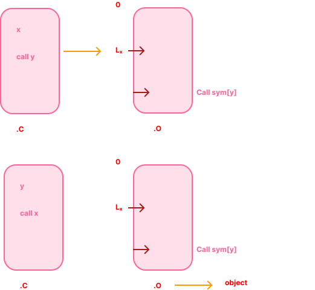
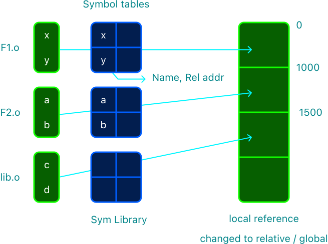
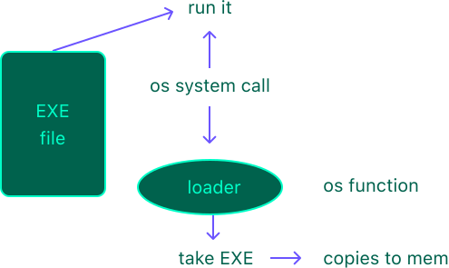
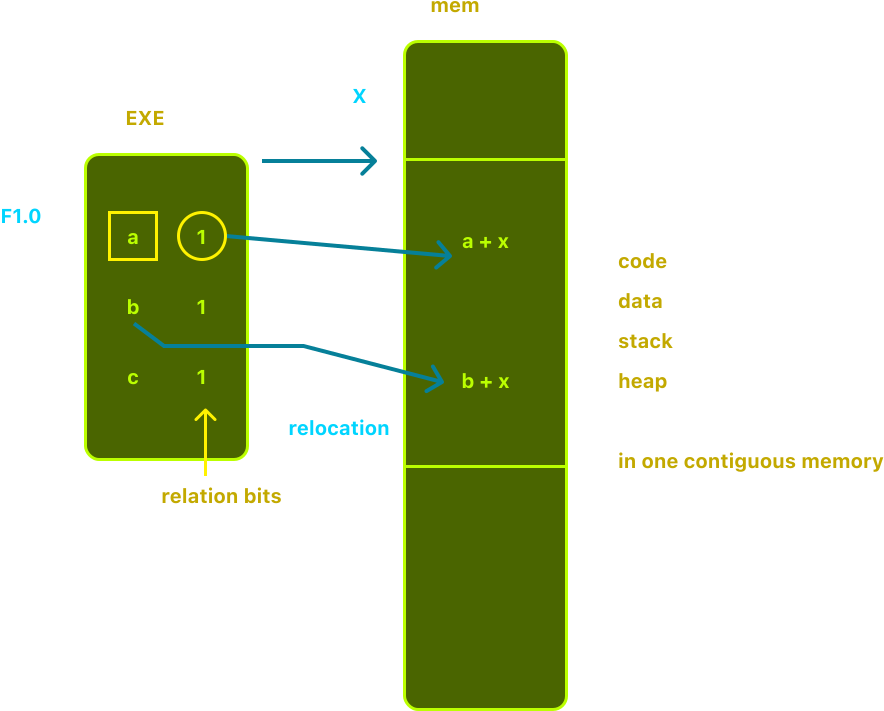
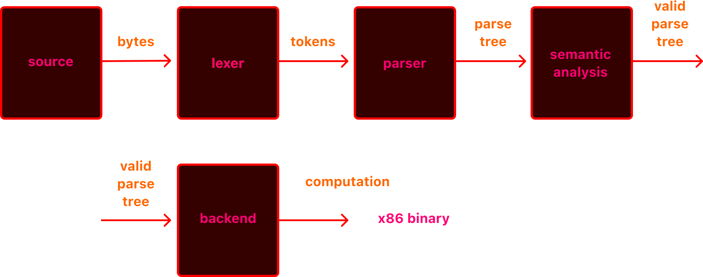

#  01 regular expressions

######  [← back](../README.md)

## table of contents  

1.  [overview](#overview)
2.  [outcomes/objectives](#outcomesobjectives)
3.  [activities](#activities)
4.  [textbook readings](#textbook-readings)
5.  [lexical analysis: language and syntax](#lexical-analysis-language-and-syntax)
6.  [lexical analysis: regular expressions](#lexical-analysis-regular-expressions)
7.  [lexical analysis: concatenation](#lexical-analysis-concatenation)
8.  [lexical analysis: kleene star](#lexical-analysis-kleene-star)
9.  [lexical analysis: regular expression examples](#lexical-analysis-regular-expression-examples)
10. [lexical analysis: longest matching prefix rule](#lexical-analysis-longest-matching-prefix-rule)
11.  [practice quiz](#practice-quiz)

##  principles of programming languages

1.  [principles of programming languages](#principles-of-programming-languages)
2.  [what is a programming language](#what-is-a-programming-language)
3.  [how does the computer understand your instructions](#how-does-the-computer-understand-your-instructions)
4.  [how do they work](#how-do-they-work)
5.  [compiler](#compiler)
6.  [relocation](#relocation)
7.  [linker](#linker)
8.  [loader](#loader)
9.  [create a process](#create-a-process)
10.  [overview of program interpretation](#overview-of-program-interpretation)
11.  [what makes a program valid?](#what-makes-a-program-valid)

##  lexical analysis</summary>

1.  [lexical analysis](#lexical-analysis)
2.  [language syntax](#language-syntax)
3.  [strings](#strings)
4.  [languages](#languages)
5.  [regular expressions](#regular-expressions)
8.  [operator precedence](#operator-precedence)
9.  [regular expressions](#regular-expressions-1)
10. [kleene star](#kleene-star)
12. [tokens](#tokens)
13. [lexical analysis](#lexical-analysis)
14. [longest matching prefix rule](#longest-matching-prefix-rule)
15. [mariner 1](#mariner-1)
16. [lexical analysis continued](#lexical-analysis-continued)

##  overview

lexical analysis is the process of checking the syntac of a given programming language.  in lexical analysis, regular expressions are used as a way to represent the tokens of a programming language.  longest matching prefix rule says that if there are more than one match, the longest match should be returned and is a way of resolving ambiguity when there are multiple matches.

##  outcomes/objectives

1.  explain what lexical analysis is
2.  describe what regular expressions are
3.  describe the language of a regular expression
4.  describe the concatenation of kleene star operator of regular expressions
5.  write regular expressions for a given token
6.  apply the longest matching prefix rule

##  activities

[homework 1](./01-homework.md)
[project 1](./01-project.md)

for project 1 you will work on a programming project implementing a lexer to generate toakens as discussed in this chapter.  refer to the project manual for complete details and the accompanying zip file for the starter code with some implementation.  refer to the project manual (instructions and implementation guide) for submission details.

your submission will be checked for plagiarism.  refer to the asu integrity policy.  collaboration with peers, getting coding help from outsite, and copying code from online resources such as github repositories, course hero, and chegg are not allowed.  you are not allowed to share the code or host it in a public repository.

##  textbook readings

**programming languages: principles and practice**

- [ ] chapter 1 - introduction - section 1.1 origins of programming languages
- [ ] chapter 1 - introduction - section 1.4 language definition
- [ ] chapter 1 - introduction - section 1.5 language translation
- [ ] chapter 6 - syntax - section 6.1 lexical structure of programming languages

**compiler construction: principles and practice**

- [ ] chapter 2 - scanning - section 2.2 regular expressions

----------

##  lexical analysis: language and syntax

overview of programming languages.

what is a programming language, how does it work, and how does the computer know what to do?  view the following powerpoint to learn more.

##  principles of programming languages

###  what is a programming language

-  a structured way to define computation
-  is it the only definition /  purpose?
    -  communicate an algorithm
    -  describe a process
    -  communicate a system to another person
    -  communicate instructions to a machine

###  how does the computer understand your instructions

the cpu understands assembly language

-  programs translate your intentions to the assembly language that the cpu understands
-  compilers
    -  translate programming language to executable binary
-  interpreters
    -  understand a programming language and perform the actual computation
-  transpilers
    -  translate a programming language to another programming language

###  how do they work

-  in this class we will study how these programs are able to translate a high level programming language into something the computer can understand

-  theory
    -  enables us to define what we can do and cannot do when defining a programming language
-  practice
    -  empowers us to develop domain specific languages, task specific compilers, static analysis, parsing...

###  compiler

compiler converts high level code into machine code (well not really)

relative references for functions define in your code

symbolic references for functions not defined in your code



###  relocation

-  table of pointers to lines of code that need linking to different libraries
    -  the symbolic references
-  a symbol table is also created in this step, which has information about the symbols and what functions have to be loaded for a given symbol.

###  linker

uses relation table to find lines of code to be replaced and then uses the symbol tables to find which functions have to be used.



1.  create 1 output binary (merged), start at 0
2.  fix all local references with global relative addresses
3.  fix all symbolic refs

###  loader



takes the output of linker and copies them to memory



###  create a process

-  process control blocks `pcb`
   -  process id
   -  process counter = start address of code
   -  status register
-  put the `pcb` in the ready queue

###  overview of program interpretation



###  what makes a program valid?

1.  **syntax**  what does it mean to look like a valid program?
2.  **semantics**  what does it mean for a program to be valid?
3.  **correctness**  is the program the correct one for the job?

-------------

lexical analysis

a programming language must have a clearly specified syntax.  lexical analysis is the process of checking the syntax of a given programming language.  refer to the lexical analysis powerpoint and watch the video below for more information.

##  lexical analysis

###  language syntax

###  strings

###  languages

###  regular expressions

###  $L \left( R_{1} \mid R_{2} \right) = L \left( R_{1} \right) \cup L \left( R_{2} \right)$

###  $L \left( R_{1} \cdot R_{2} \right) = L \left( R_{1} \right) \cdot L \left( R_{2} \right)$

###  operator precedence

###  regular expressions

###  kleene star

###  $L \left(R^{*} \right) = \bigcup_{i \geq 0} {{L}^{i} \left(R \right)}$

###  tokens

###  lexical analysis

###  longest matching prefix rule

###  mariner 1

###  lexical analysis continued

## lexical analysis: regular expressions

in lexical analysis, regular expressions are used as a way to represent tokens of a programming language

## lexical analysis: concatenation

concatenation operation on regular expressions is defined as

$L \left( R_{1} . R_{2} \right) = L \left( R_{1} . R_{2} \right)$

$R_1 \cdot R_2 = \{ xy \mid x \in R_1 \text{ and } y \in R_2 \}$

##  lexical analysis: kleene star

kleene star operator is an operation performed on regular expressions.  it is denoted as

$L \left( R^{*}\right) . \; L \left(R^{*} \right)= \{ \varepsilon \} \; \cup \; L\left(R\right) \cup \; L\left( R \right) . \; L\left( R \right) \cup L\left( R \right) . \; L\left( R \right) . \; L\left( R \right) \cup \cdots$

##  lexical analysis: regular expression examples

in this video we will see some examples of how regular expressions are used.

##  lexical analysis: longest matching prefix rule

longst matching prefix rule says that if there are more than one match, the longest match should be returned.  this is a way of resolving ambiguity when there are multiple matches.

##  practice quiz

the questions in this quiz are derived from the content presented in module 1.  the practice quiz is intended as a knowledge check for mastery of objectives in this module.  it provides a sample of questions you will see in the midterm exam for the course.

1.  consider the following code

```c++
Token LexicalAnalyzer::GetToken() {
    input.GetChar(c);
    switch (c) {
        case '=':
            input.GetChar(c);
            if (c == '=') {
                tmp.token_type = EQEQ;
            } else if
    }
}
```

##  section 1.4 language definition
##  section 1.5 language translation

#  chapter 6 - syntax

##  section 6.1 lexical structure of programming languages

#  chapter 2 - scanning

##  section 2.2 regular expressions

-----

#  chapter 1 - introduction

###  origins of programming languages

the following shows a rough timeline for teh creation of several of the major programming languages.  note that someo fthe languages are embedded in a family tree, indicating their evolutionary relationships.

a definition often advanced for a programming language is a notation for communicating to a computerwhat we want it to do, but this definition is inadequate.  before the middle of the 1940s computer operators hardwired their programs.

that is, they set switches to adjust the internal wiring of a computer to perform the requested tasks.  this effictively communicated to the computer what computations were desired, but programming, if it could be called that, consisted of the expensive and error prone activity of taking down the hardware to restructure it.  thsi section examines the origins and emergence of programming languages, which allowed computer users to solve problems without having to become hardware engineers.

###  machine language and the first stored programs

a major advance in computr design occurred in the late 1940s, when john von neumann had the idea that a computer should be permanently hardwired with a small set of general purpose operations.  the operator could then input into the computer a series of binary codes that would organize the basic hardware operations to solve more specific problems.  instead of turning

###  language definition

documentation for the early programming languages was written in an informal way, in ordinary english.  however, as we saw earlier in thsi chapter, programmers soon became aware of the need for mroe precise descriptions of a language.  to the pont of needing formal definitions of the kind found in mathematics.  for example, without a clear notion of the meaning of programming language constructs, a programmer has no clear idea of what computation is actually being performed.  moreover, it should be possible to reason mathematically about programs, and to do this requires formal verification or proof of the behavior of a program.  without a formal definition of a language this is impossible.

but there are other compelling reasons for the need for a formal definition.  we have already mentioned the need for machine or implementation indpendence.  the best way to achieve this through standardization, which requires an independent and percise language definition th


.
