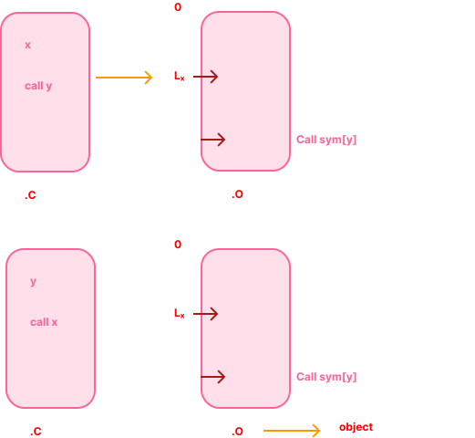
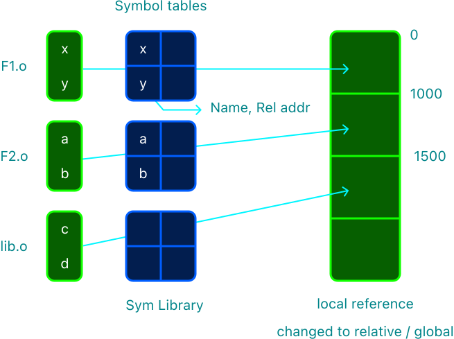
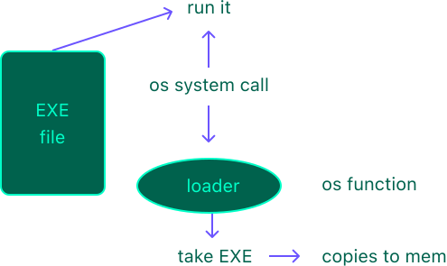
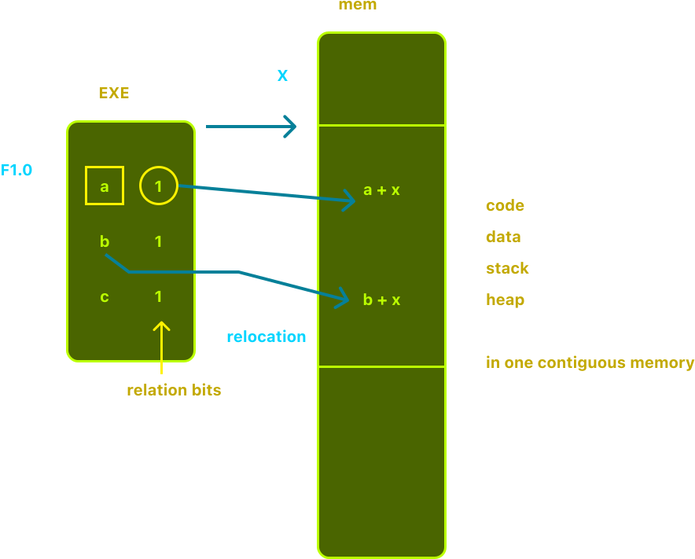
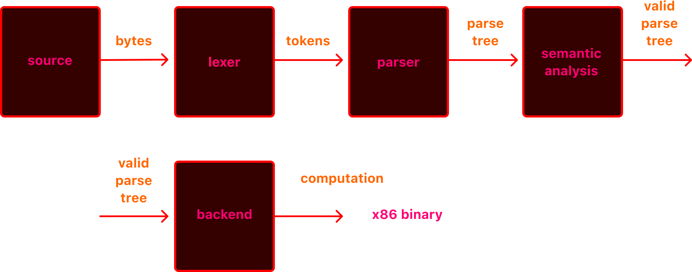

#  principles of programming languages

**contents**
1.  [what is a programming language](#what-is-a-programming-languages)
2.  [how does the computer understand your instructions](#how-does-the-computer-understand-your-instructions)
3.  [how do they work](#how-do-they-work)
4.  [compiler](#compiler)
5.  [relocation](#relocation)
6.  [linker](#linker)
7.  [loader](#loader)
8.  [create a process](#create-a-process)
9.  [overview of program interpretation](#overview-of-program-interpretation)
10.  [what makes a program valid?](#what-makes-a-program-valid)

###  what is a programming language

-  a structured way to define computation
-  is it the only definition /  purpose?
    -  communicate an algorithm
    -  describe a process
    -  communicate a system to another person
    -  communicate instructions to a machine

###  how does the computer understand your instructions

the cpu understands assembly language

-  programs translate your intentions to the assembly language that the cpu understands
-  compilers
    -  translate programming language to executable binary
-  interpreters
    -  understand a programming language and perform the actual computation
-  transpilers
    -  translate a programming language to another programming language

###  how do they work

-  in this class we will study how these programs are able to translate a high level programming language into something the computer can understand

-  theory
    -  enables us to define what we can do and cannot do when defining a programming language
-  practice
    -  empowers us to develop domain specific languages, task specific compilers, static analysis, parsing...

###  compiler

compiler converts high level code into machine code (well not really)

relative references for functions define in your code

symbolic references for functions not defined in your code

###  relocation

-  table of pointers to lines of code that need linking to different libraries
    -  the symbolic references
-  a symbol table is also created in this step, which has information about the symbols and what functions have to be loaded for a given symbol.
-  

###  linker

uses relation table to find lines of code to be replaced and then uses the symbol tables to find which functions have to be used.

1.  create 1 output binary (merged), start at 0
2.  fix all local references with global relative addresses
3.  fix all symbolic refs

###  loader

takes the output of linker and copies them to memory

###  create a process

-  process control blocks `pcb`
   -  process id
   -  process counter = start address of code
   -  status register
-  put the `pcb` in the ready queue

###  overview of program interpretation

###  what makes a program valid?

1.  **syntax**  what does it mean to look like a valid program?
2.  **semantics**  what does it mean for a program to be valid?
3.  **correctness**  is the program the correct one for the job?